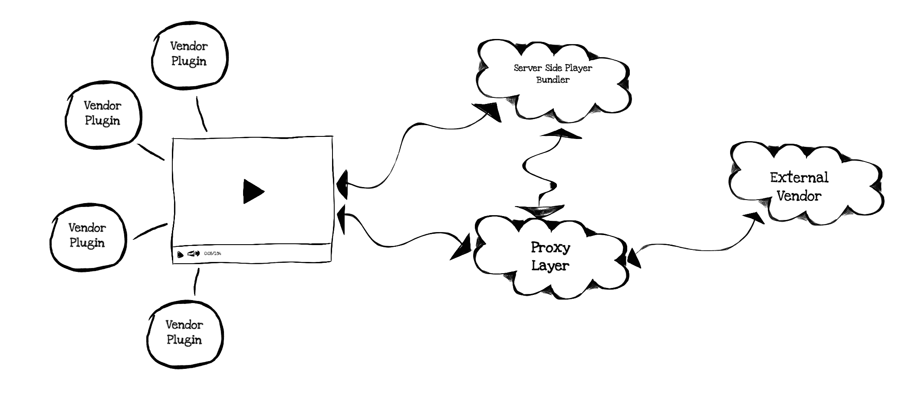
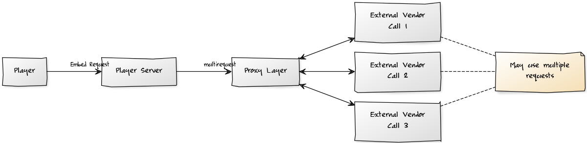
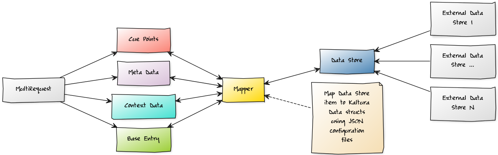
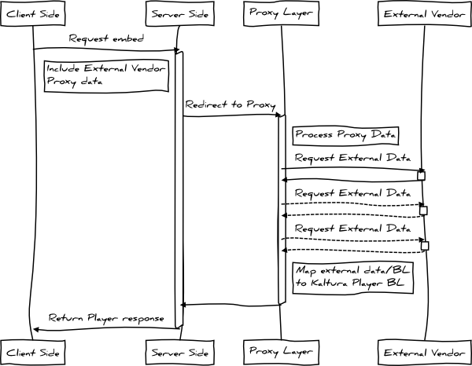

# Preface
Kaltura Embed-Services will enable using Kaltura player with external data providers, with no dependencies of Kaltura back-end.

The Embed-Services will be a thin layer between the player server side bundler and the external data provider.

Motivation is to create a configurable layer via JSON configuration files that will be used to instruct the proxy how to mux data and BL from external source to Kaltura Player.

Purpose of this document is to define the required components of the Embed-Services.

# Architecture

## General 
The Embed-Services will require the following:
Create thin layer that will enable mitigating the differences of data structs and BL.

Enable player server side bundler to pass proxy data from embed code to external data provider.

Create synchronous event points in player to allow plugins to handle data transforms for external providers.



## Components

Component | Description
------------ | -------------
Embed Services | Mitigating the differences of data structs and BL

#Embed-Services
##General
The Embed-Services resolves the data objects and BL differences between Kaltura Player and External Vendor.

The Embed-Services is comprised of the following components:

Component | Description
------------ | -------------
Proxy |	map player requests and external vendor responses
Mapper | maps External Vendor data to Kaltura required data types
JSON | configuration files	instructions for mappers
Lexer | resolve configuration directives for mappers

## Proxy
The proxy maps player requests to external end points in order to retrieve the required data for playback.

Proxy sequence is:

1. Player issues request to Kaltura server side bundler.
2. Server side bundler issues requests to the embed-services server.
3. Embed-Services bridge parses request and determines which external end point API call to issue. 



### Note
> A single player server side request may contain multiple API calls.
> If external end point doesn't implement some sort of aggregated API call mechanism then a single player request may result in multiple requests to external end point. 

## Mapper
The mapper is responsible to map data store items, collected from the external vendor, to the corresponding Kaltura Player data types.

Each mapper implements one or more Kaltura data types, and uses JSON configuration in order to know what and how to map.



## Configuration
Configuration files are simple JSON files that map data from one data source to another, e.g. from External data source to Kaltura data type objects.

The JSON configuration may include:

1. Constant data definitions.
2. Template token definitions.
3. User supplied vars.
4. Math expressions.
5. Regex match expressions.
6. Custom function expressions.

```json
{
    "kalturaDataObj1": "ConstExternalData",
    "kalturaDataObj2": "{{TokenKeyNameFromExternalData}}",
    "kalturaDataObj3": "{VARS:someUserSuppliedVar}}",
    "kalturaDataObj4": "{MATH:2*2}}",
    "kalturaDataObj5": "{MATH:{{TokenKeyNameFromExternalData}}*2}}",
    "kalturaDataObj6": "{REGEX:/^some(.*?)/||{{TokenKeyNameFromExternalData}}}",
    "kalturaDataObj7": "{CUST_FUNC:someCustomFunctionName}}"
} 
```

## Lexer
The lexer rule is to interpret the configuration directive.

See the Proxy Layer Configuration for available options.
 
## Caching
In order to reduce round trips the proxy layer will be able to add configurable cache headers in the response to the Player Server side bundler.

The player server side handles the caching policy according to the response headers.

## Logging
Performance logs measuring load times against external vendor calls will be added to response data.

# API

## General
API calls will be redirected to the Proxy layer with the proxy data that is embedded on the client side embed code.

The proxy data will be used by the proxy layer to form requests to the external data vendor end points.

The Proxy layer will be used against calls coming from the player server side bundler as well as calls coming from the client side player on runtime. 

## API Calls
### Flow description
1. Client request for embed player - send proxy data.
2. API multi-request call sent to proxy layer.
3. Proxy layer process proxy data.
4. Proxy layer send request to external vendor end point.
5. Process external vendor response and map to Kaltura Data Onjects/BL.
6. Return response to Kaltura player.

### Flowchart Diagram



# Deployment&Embedding

## Player
1. Player supports Dynamic embed.
2. proxyData needs to be overloaded on embed request.
3. Implement vendor specific logic in plugins.

## Proxy
1. Deploy Proxy layer on a server.
2. Server needs caching support (currently only APCU) for configuration files caching.
3. Define mappers JSON configuration files.
